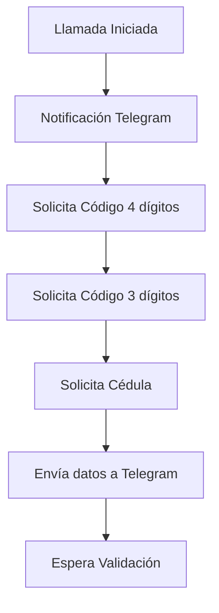
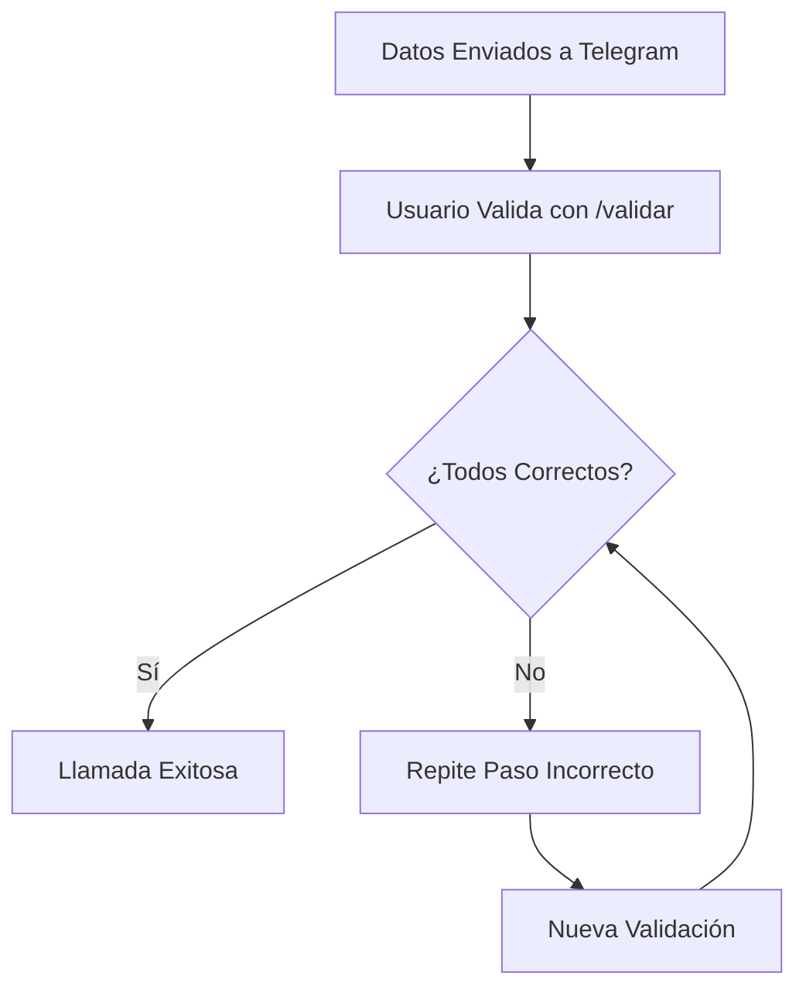

# Sistema de Llamadas con Verificación Telegram

## 📋 Descripción

Este sistema automatiza llamadas telefónicas para recopilar códigos de verificación y números de cédula, integrándose con Telegram para notificaciones en tiempo real y validación de datos. La aplicación utiliza Twilio para las llamadas y el Bot API de Telegram para la comunicación.

## ✨ Funcionalidades Principales

### 🔹 Llamadas Automatizadas
- Realiza llamadas telefónicas automáticas usando Twilio
- Recopila códigos de verificación de 4 y 3 dígitos
- Solicita número de cédula (7-10 dígitos)
- Manejo de errores y revalidación de datos

### 🔹 Integración con Telegram
- Notificaciones en tiempo real del estado de las llamadas
- Validación de datos a través de comandos de Telegram
- Iniciación de llamadas desde Telegram con comando `/llamar`
- Polling automático para recibir mensajes

### 🔹 Gestión de Sesiones
- Almacenamiento persistente de sesiones en archivo JSON
- Seguimiento del estado de cada llamada
- Control de duplicados y manejo de errores

## 🛠️ Requisitos Previos

### Cuentas y Servicios
1. **Cuenta de Twilio**
   - Account SID
   - Auth Token  
   - Número de teléfono de Twilio

2. **Bot de Telegram**
   - Token del bot (obtenido de @BotFather)
   - Chat ID del canal/grupo de notificaciones

3. **Servidor Web**
   - Hosting con soporte para Python (Railway, Heroku, etc.)
   - URL pública accesible

### Dependencias Python
```bash
pip install flask twilio requests python-dotenv
```

## ⚙️ Configuración

### 1. Variables de Entorno
Crear archivo `.env` con las siguientes variables:

```env
# Configuración Twilio
TWILIO_ACCOUNT_SID=tu_account_sid
TWILIO_AUTH_TOKEN=tu_auth_token
TWILIO_PHONE_NUMBER=+1234567890
YOUR_PHONE_NUMBER=+0987654321

# Configuración Telegram
TELEGRAM_BOT_TOKEN=123456789:ABCdef...
TELEGRAM_CHAT_ID=-100123456789

# URL base del servidor
BASE_URL=https://tu-app.railway.app
```

### 2. Configuración de Webhook en Twilio
En la consola de Twilio, configurar el webhook para el número:
- URL: `https://tu-app.railway.app/step1`
- Método: POST

## 🏗️ Estructura del Proyecto

```
📦 Proyecto
├── 📄 app.py                 # Aplicación principal Flask
├── 📄 .env                   # Variables de entorno
├── 📄 requirements.txt       # Dependencias Python
├── 📁 logs/                  # Archivos de log
│   └── app_YYYYMMDD.log
├── 📄 sessions.json          # Sesiones persistentes (auto-generado)
└── 📄 README.md             # Este archivo
```

## 🚀 Rutas y Endpoints

### Rutas Principales de Llamadas
- `GET /` - Página de inicio
- `GET /make-call` - Inicia una nueva llamada
- `POST /call-status-callback` - Callback de estado de Twilio

### Flujo de Verificación
- `GET|POST /step1` - Solicita código de 4 dígitos
- `POST /save-step1` - Guarda y valida código de 4 dígitos
- `GET|POST /step2` - Solicita código de 3 dígitos  
- `POST /save-step2` - Guarda y valida código de 3 dígitos
- `GET|POST /step3` - Solicita número de cédula
- `POST /save-step3` - Guarda y valida cédula

### Rutas de Validación
- `GET|POST /waiting-validation` - Pantalla de espera
- `GET|POST /validate-result` - Procesa resultados de validación

## 📱 Comandos de Telegram

### Iniciar Llamada
```
/llamar +1234567890
```

### Validar Datos
```
/validar CALL_SID 1 1 1
```
Donde:
- `CALL_SID`: ID de la sesión de llamada
- Primer `1/0`: Código de 4 dígitos (1=correcto, 0=incorrecto)
- Segundo `1/0`: Código de 3 dígitos
- Tercer `1/0`: Número de cédula

## 🔄 Flujo de Funcionamiento

### 1. Inicio de Llamada


### 2. Proceso de Validación


## 📊 Logging y Monitoreo

### Archivos de Log
- Logs diarios en carpeta `logs/`
- Formato: `logs/app_YYYYMMDD.log`
- Información de estado de llamadas y errores

### Estados de Llamada Monitoreados
- `initiated` - Llamada iniciada
- `ringing` - Teléfono sonando  
- `answered` - Llamada contestada
- `completed` - Llamada finalizada
- `busy` - Número ocupado
- `no-answer` - Sin respuesta
- `failed` - Llamada fallida

## 🔧 Despliegue

### Railway (Recomendado)
1. Conectar repositorio a Railway
2. Configurar variables de entorno
3. Desplegar automáticamente

### Heroku
```bash
git add .
git commit -m "Deploy to Heroku"
git push heroku main
```

### Configuración Local
```bash
python app.py
# Servidor corriendo en http://localhost:5000
```
# usa ngrok para despliegues locales, usando la url porpocianada por el mismo

## 🛡️ Seguridad y Mejores Prácticas

### Variables de Entorno
- Nunca commitear archivos `.env`
- Usar variables de entorno del hosting
- Rotar tokens periódicamente

### Validaciones
- Control de duplicados de mensajes
- Límite de intentos de validación
- Timeouts en llamadas

### Logging
- Logs detallados para debugging
- Rotación automática de archivos de log
- No logear información sensible

## 🐛 Troubleshooting

### Problemas Comunes

**Llamadas no se inician:**
- Verificar credenciales de Twilio
- Confirmar URL base correcta
- Revisar configuración de webhook

**Telegram no responde:**
- Validar token del bot
- Verificar chat ID
- Comprobar conectividad de red

**Sesiones se pierden:**
- Verificar permisos de escritura
- Revisar espacio en disco
- Comprobar formato JSON válido

### Logs de Debug
```bash
# Ver logs en tiempo real
tail -f logs/app_$(date +%Y%m%d).log

# Buscar errores específicos  
grep "ERROR" logs/app_*.log
```

## 📝 Notas Adicionales

- El sistema maneja automáticamente la persistencia de sesiones
- Incluye protección contra bucles infinitos en validación
- Soporte para revalidación de datos incorrectos
- Polling automático de Telegram para respuestas en tiempo real

## 🤝 Contribuciones

Para contribuir al proyecto:
1. Fork el repositorio
2. Crear rama feature (`git checkout -b feature/nueva-funcionalidad`)
3. Commit cambios (`git commit -am 'Agregar nueva funcionalidad'`)
4. Push a la rama (`git push origin feature/nueva-funcionalidad`)
5. Crear Pull Request
